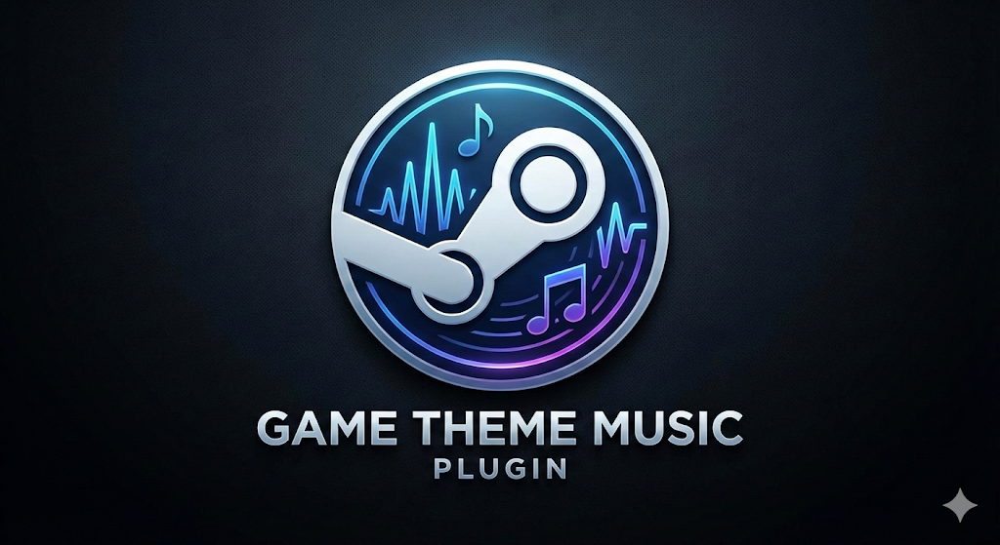
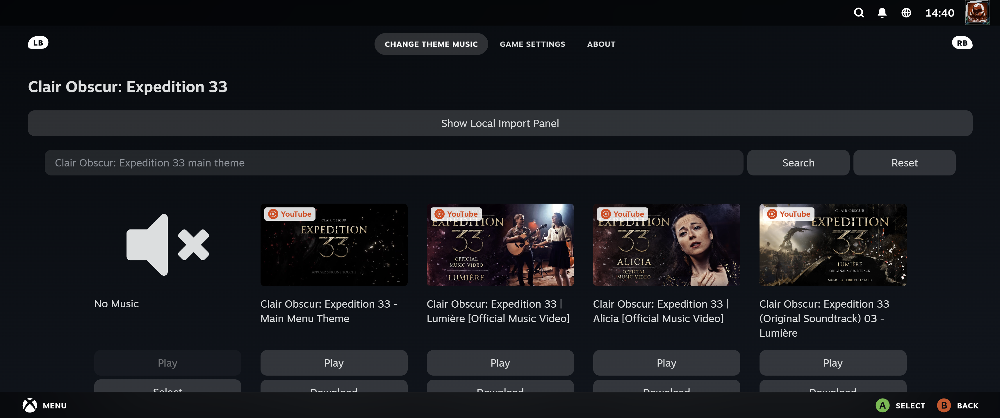
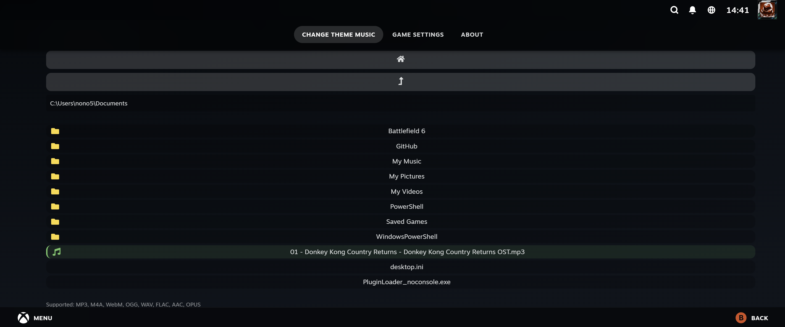

<h1 align="center">
  
</h1>
<div align="center">
<h2>Game Theme Music</h2>
  Play theme songs on your game pages. Compatible with AudioLoader and Decky Loader.

  <a href="https://github.com/Nytuo/SDH-GameThemeMusic/issues/new?assignees=&labels=bug&template=01_BUG_REPORT.md&title=bug%3A+">Report a Bug</a> | 
  <a href="https://github.com/Nytuo/SDH-GameThemeMusic/issues/new?assignees=&labels=enhancement&template=02_FEATURE_REQUEST.md&title=feat%3A+">Request a Feature</a> |
  <a href="https://github.com/Nytuo/SDH-GameThemeMusic/discussions">Ask a Question</a>
</div>

<div align="center">
<br />

[](https://github.com/Nytuo/SDH-GameThemeMusic/actions/workflows/build.yml)

[](LICENSE)

</div>

<details open="open">
<summary>Table of Contents</summary>

- [About](#about)
- [Features](#features)
- [Getting Started](#getting-started)
  - [Prerequisites](#prerequisites)
  - [Installation](#installation)
- [Usage](#usage)
- [Screenshots](#screenshots)
- [Contributing](#contributing)
- [Authors & Credits](#authors--credits)
- [License](#license)

</details>

---

## About

Game Theme Music is a Decky Loader plugin for Steam Deck and desktop Big Picture mode. It automatically finds and plays theme music for your games, supporting both Steam and non-Steam games. Songs are fetched online and can be customized per game via the context menu.

## What The Fork?

I have decided to make my own fork of this project to add new features that I wanted such like: 
- Windows support
- Additional music providers (but removing Invidious cause I don't like it)
- Add local Music file support
- Auto download the music for offline playback (the user has no longer the choice to stream only)

I do not plan to maintain this actively, just building this for my own use and sharing it with the community.

PRs and issues are welcome of course.

Tested mainly on Windows with Big Picture mode, Steam Deck with SteamOS is secondary but should work as well.

Thanks again to the original author and contributors for making this plugin!

## Features

- Plays theme music for games on your library pages
- Supports both Steam and non-Steam games
- Customizable music per game via context menu
- Compatible with [AudioLoader](https://github.com/EMERALD0874/SDH-AudioLoader) (v1.5.0+)

## Getting Started

### Prerequisites

- Steam Deck or Steam Big Picture mode
- [Decky Loader](https://github.com/SteamDeckHomebrew/decky-loader) - For Windows version use the gh actions builds
- Internet connection (for fetching music)

### Installation

Since this plugin is not available in the Decky Loader plugin store, you will need to install it manually or via the GitHub Actions builds.

1. Install Decky Loader (see [Decky Loader instructions](https://github.com/SteamDeckHomebrew/decky-loader)) or follow a Windows installation guide.
2. Download the latest release from the [GitHub Actions builds](https://github.com/Nytuo/SDH-GameThemeMusic/actions/workflows/build.yml).
3. Extract the downloaded ZIP file.
4. Copy the extracted folder to your Decky Loader plugins directory:
   - On SteamOS (including Steam Deck): `~/.homebrew/plugins/`
   - On Windows: `%USER%\homebrew\plugins\`
5. Add `yt-dlp` binary under the bin folder in the plugin folder for proper YouTube support. (windows or linux version depending on your OS)
5. Restart Decky Loader or Steam Deck to load the new plugin.
6. Enjoy your game theme music!

Or, for manual build:

```bash
# Clone the repository
git clone https://github.com/Nytuo/SDH-GameThemeMusic.git
cd SDH-GameThemeMusic
# Build the plugin
pnpm install
pnpm run build:local
# Copy the built plugin under out directory to Decky Loader plugins directory
```

## Usage

- The plugin will automatically play a theme song when you view a game page.
- To customize the song for a game select the context menu option under properties to be redirected to the song selection menu.
- Choose from multiple providers including YouTube, iTunes, and local files.

## Screenshots


Selection of a custom theme song from the context menu.


Usage of multiple providers like YouTube and iTunes.


Can use locally stored music files.


## Contributing

Contributions are welcome! Open an issue or pull request on GitHub to contribute !

## Authors & Credits

- Original: [OMGDuke](https://github.com/OMGDuke)
- Continuation: [MegalonVII](https://github.com/MegalonVII)
- This fork: [Nytuo](https://github.com/Nytuo)

Special thanks to all contributors and the Decky Loader community.

## License

This project is licensed under the **GNU General Public License v3.0 or later**.

See [LICENSE](LICENSE) for more information.
